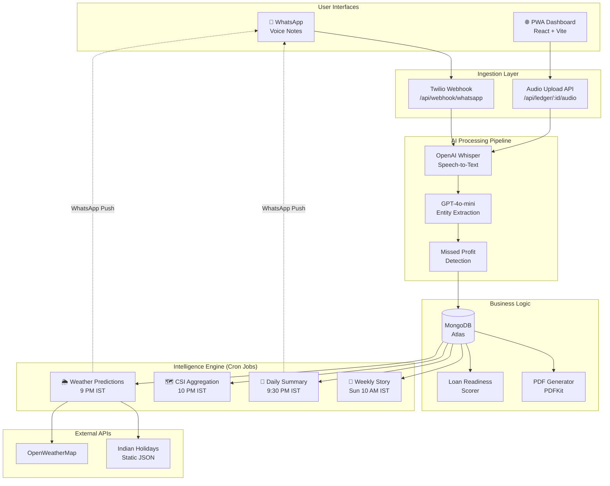

<p align="center">
  
</p>

<h1 align="center">🎙️ VoiceTrace</h1>

<p align="center">
  <b>Voice-to-Business-Intelligence Platform for India's 10M+ Street Vendors</b>
</p>

<p align="center">
  
  
  
  
  
  
</p>

---

## 📋 Table of Contents

- [Problem Statement](#-problem-statement)
- [Our Solution](#-our-solution)
- [Key Features](#-key-features)
  - [Core Features](#1--whatsapp-voice-bot-primary-ui)
  - [Advanced & Differentiator Features](#6--micro-loan-readiness-meter)
- [Architecture](#-architecture)
- [Tech Stack](#-tech-stack)
- [Project Structure](#-project-structure)
- [Database Schema Design](#-database-schema-design)
- [API Documentation](#-api-documentation)
- [Cron Jobs & Background Workers](#-cron-jobs--background-workers)
- [AI Pipeline](#-ai-pipeline-whisper--llm)
- [Getting Started](#-getting-started)
- [Environment Variables](#-environment-variables)
- [Deployment](#-deployment)
- [Contributing](#-contributing)
- [License](#-license)

---

## 🎯 Problem Statement

India has **10 million+ street vendors** who contribute significantly to the urban economy. Yet, they face critical challenges:

| Challenge | Impact |
|---|---|
| **No financial records** | Cannot prove income for loans |
| **Zero tech literacy** | Can't use accounting apps |
| **No business intelligence** | Repeat the same stock mistakes daily |
| **Language barrier** | Most apps are English-only |
| **Micro-loan exclusion** | Banks require documented income history |

The **PM SVANidhi scheme** offers micro-loans up to ₹50,000 to street vendors, but most vendors can't qualify because they have no documented business history.

## 💡 Our Solution

**VoiceTrace** lets vendors speak naturally in **Hindi, English, or Hinglish** — either through **WhatsApp** (zero app install) or a **PWA dashboard** — and automatically:

1. 🗣️ Converts voice to structured financial data
2. 📒 Maintains a daily running ledger
3. 🌦️ Generates weather & holiday-aware stock predictions
4. 🎯 Tracks a gamified micro-loan readiness score
5. 📄 Exports income statements as PDF for loan applications
6. 🗺️ Provides area-level market intelligence from anonymized vendor data

**Zero typing. Zero learning curve. Just speak.**

---

## ✨ Key Features

### 1. 🗣️ WhatsApp Voice Bot (Primary UI)

The primary interface — vendors simply send a **voice note on WhatsApp**. No app download, no signup forms, no learning curve.

**How it works:**
```
Vendor sends WhatsApp voice note (up to 3 minutes)
    ↓
Twilio Webhook receives the audio
    ↓
Audio downloaded from Twilio Media URL
    ↓
OpenAI Whisper transcribes (Hindi/English/Hinglish)
    ↓
GPT-4o-mini extracts structured entities (items, prices, expenses)
    ↓
Saved to MongoDB ledger → Loan score updated
    ↓
Formatted summary reply sent back to vendor
```

**Supported interactions:**
| Message Type | Action |
|---|---|
| **Voice note** | Transcribe → extract → save → reply with summary |
| **"YES" / "haan"** | Confirm today's ledger entry |
| **"NO" / "nahi"** | Reject entry, prompt re-recording |
| **Any other text** | Show help instructions |
| **First-time message** | Auto-register vendor + send welcome |

**Sample voice input & response:**
```
🎙️ Vendor says: "Aaj 50 samose beche 10 rupaye mein, 
                  chai bechke 500 rupaye aaye, 
                  200 rupaye ka tel kharida, 
                  aur samose shaam ko khatam ho gaye"

📒 Bot replies:
━━━━━━━━━━━━━━━━━━━━
Aaj ka Hisaab:

💰 Bikri (Sales):
  • samosa: 50x ₹10 = ₹500
  • chai: 50x ₹10 = ₹500

💸 Kharcha (Expenses):
  • cooking oil: ₹200

📉 Chhoota Hua Munafa:
  • samosa: ~₹200 ("khatam ho gaye")

📊 Total Bikri: ₹1000
📊 Total Kharcha: ₹200
📊 Munafa: ₹800
━━━━━━━━━━━━━━━━━━━━
Sahi hai? Reply: YES / NO
```

---

### 2. 🧠 AI Entity Extraction Engine

The core intelligence layer that converts unstructured speech into structured JSON business data.

**Extraction capabilities:**

| Entity | What It Extracts | Example Input |
|---|---|---|
| **Items Sold** | Name, quantity, unit price, total | "50 samose 10 rupaye mein" → `{samosa, 50, ₹10, ₹500}` |
| **Expenses** | Category, amount, description | "200 ka tel kharida" → `{raw_material, ₹200, cooking oil}` |
| **Missed Profits** | Item, estimated loss, trigger phrase | "samose khatam ho gaye" → `{samosa, ~₹200, "khatam ho gaye"}` |

**Confidence Scoring System:**

| Score | Meaning | Example |
|---|---|---|
| **1.0** | Vendor stated exact numbers | "50 samose 10 rupaye mein" |
| **0.8** | Reasonable inference | "chai bechke 500 rupaye aaye" |
| **0.6** | Approximate / range values | "30-35 rupaye mein becha" |
| **0.4** | Educated guess | Unclear audio, context-based |

Items with confidence < 0.7 are flagged with ⚠️ in the reply for vendor review.

**LLM Prompt Engineering highlights:**
- Vendor-specific vocabulary prompt for Whisper (samosa, vada pav, chai, gola, paan…)
- Category-aware extraction (e.g., a "fruits" vendor vs "snacks" vendor)
- Hindi/Hinglish trigger phrase detection for missed profits
- `response_format: json_object` for strict JSON output
- `temperature: 0.1` for deterministic extraction
- Post-processing sanitizers to validate all numeric values

---

### 3. 📒 Smart Ledger System

Automatic daily financial ledger maintained in MongoDB.

**Features:**
- **Append-only daily entries** — Multiple voice notes in a day append to the same entry
- **Auto-computed totals** — `totalRevenue`, `totalExpenses`, `netProfit` via Mongoose pre-save hook
- **Vendor confirmation** — Hybrid flow: auto-commit + daily summary for YES/NO confirmation
- **30-day aggregation** — `getVendorSummary()` with revenue, expenses, profit, missed revenue, avg daily, std deviation
- **GeoJSON location** — Each entry tagged with vendor location for CSI
- **Processing metadata** — Whisper duration, LLM model used, tokens consumed

**Aggregation pipeline for vendor summary:**
```javascript
LedgerEntry.getVendorSummary(vendorId, 30)
→ { totalRevenue, totalExpenses, totalProfit, 
     totalMissedRevenue, entryCount, avgDailyRevenue, revenueStdDev }
```

---

### 4. 🌦️ Weather-Aware Stock Predictions

**THE CRITICAL DIFFERENTIATOR** — Cross-references vendor sales data with tomorrow's weather forecast and upcoming Indian holidays to generate proactive stock advice.

**Data sources:**
| Source | Data Used |
|---|---|
| **OpenWeatherMap API** | 24-hour forecast (temp, rain probability, humidity, wind) |
| **Static Indian Holidays JSON** | 36 national/regional/religious festivals with affected items |
| **Seasonal Factors** | 5 seasons with high/low demand items |
| **Vendor's own sales history** | Top 5 selling items from last 7 days |

**Weather advisory logic:**

| Condition | Advisory | Stock Adjustment |
|---|---|---|
| Rain (>50% probability) | "Kal baarish ke chances hain" | Cold items -20%, Hot items +30% |
| Extreme heat (>40°C) | "Bohot garmi hogi" | Cold items +40%, Hot items -20% |
| Hot day (>35°C) | "Garmi hogi" | Cold items +20% |
| Cold (<15°C) | "Thand hogi" | Hot items +30%, Cold items -30% |
| High humidity (>85%) | "Umass hogi" | Cold items +15% |

**Holiday intelligence (36 festivals):**
```
🎉 Diwali aa raha hai! sweets, diyas, candles, crackers, 
   dry_fruits, flowers, decoration zyada rakhna.
```

Covers: Diwali, Holi, Eid, Ganesh Chaturthi, Pongal, Navratri, Dussehra, Raksha Bandhan, Janmashtami, Onam, Bihu, Christmas, Lohri, Makar Sankranti, and 22 more with region-specific targeting.

**Seasonal demand mapping:**
| Season | Months | High Demand | Low Demand |
|---|---|---|---|
| Summer | Apr-Jun | Ice gola, lassi, nimbu paani, kulfi | Hot snacks, chai |
| Monsoon | Jul-Sep | Chai, pakora, bhutta, samosa | Ice gola, cold drinks |
| Winter | Nov-Feb | Chai, gajar halwa, gajak | Cold drinks, ice cream |

**Cron schedule:** Runs daily at **9:00 PM IST** → pushes advice via WhatsApp before next morning.

---

### 5. 📄 Earnings Summary & PDF Export

Generates a professional **1-page A4 PDF income statement** that vendors can submit for micro-loan applications.

**PDF contents:**
```
┌────────────────────────────────────────────────┐
│                  VOICETRACE                     │
│             Income Statement                    │
│                                                 │
│  Vendor: Ramesh Kumar                           │
│  Phone: +91-9876543210                          │
│  Category: Street Food                          │
│  Period: 01 Mar 2026 - 28 Mar 2026 (30 days)   │
│                                                 │
│  ──── SUMMARY ────                              │
│  Total Revenue:     ₹45,000                     │
│  Total Expenses:    ₹12,000                     │
│  Net Profit:        ₹33,000                     │
│  Avg Daily Revenue: ₹1,500                      │
│  Days Logged:       28                           │
│  Missed Revenue:    ₹5,200                      │
│                                                 │
│  ──── DAILY BREAKDOWN ────                      │
│  Date    Revenue  Expense  Profit  Items  Status│
│  01 Mar  ₹1,200   ₹350    ₹850    4     ✓      │
│  02 Mar  ₹1,800   ₹400    ₹1,400  6     ✓      │
│  ...                                            │
│                                                 │
│  ──── MICRO-LOAN READINESS ────                 │
│  Score: 82/100                                  │
│  Status: READY for PM SVANidhi                  │
│  Streak: 28 consecutive days                    │
│                                                 │
│  Auto-generated by VoiceTrace for PM SVANidhi   │
└────────────────────────────────────────────────┘
```

---

### 6. 🎯 Micro-Loan Readiness Meter

A **gamified trust score** (0-100) that shows vendors how close they are to qualifying for PM SVANidhi loans. Acts as a daily motivator to keep logging.

**Scoring Formula:**

| Factor | Weight | Max Score | Logic |
|---|---|---|---|
| 🔥 **Consecutive Logging Days** | 40% | 40 pts | Linear scale, maxes at 30 days |
| 📈 **Revenue Stability** | 25% | 25 pts | `(1 - coefficient_of_variation) × 25` |
| 💰 **Average Daily Revenue** | 15% | 15 pts | Normalized against ₹5,000/day cap |
| 💸 **Expense Tracking** | 10% | 10 pts | % of days with expenses logged |
| 👤 **Profile Completeness** | 10% | 10 pts | Name + category + location + Aadhaar |

**Threshold:** **≥ 75/100 = "Loan Ready" 🎉**

**Frontend visualization:** Animated SVG gauge with gradient coloring:
- 🔴 Red (0-49): Early stage
- 🟡 Amber (50-74): Building track record
- 🟢 Green (75-100): PM SVANidhi Ready!

**Streak tracking:**
- Same-day multiple recordings → streak unchanged
- Next-day recording → streak +1
- Missed a day → streak resets to 1

---

### 7. 📉 Missed Profit Detector

Automatically detects when vendors mention items that **ran out or couldn't be sold**, estimating the lost revenue.

**Trigger phrases detected:**

| Hindi | English |
|---|---|
| "khatam ho gaya" / "khatam ho gaye" | "ran out" / "sold out" |
| "nahi bach paya" | "could have sold more" |
| "aur bik sakte the" | "out of stock" |
| "jaldi khatam" / "stock khatam" | "people were asking" |
| "zyada la sakte the" | "shortage" |
| "demand thi par nahi tha" | — |
| "log maang rahe the" | — |

**Lost revenue estimation:** Based on the item's selling price × estimated additional units (10-30).

**Output:**
```
📉 Missed Profits:
  • samosa: ~₹200 ("khatam ho gaye")
  • nimbu paani: ~₹150 ("log maang rahe the")
```

---

### 8. 📖 Story Mode (Narrative Insights)

Generates a **weekly plain-language story** of the vendor's business — like a friendly mentor reviewing their week.

**Generated every Sunday at 10:00 AM IST** using GPT-4o-mini.

**Sample output (Hindi):**
```
📖 Ramesh ji ka Hafta

Namaste Ramesh ji! Ye raha aapke hafte ka hisaab.

Is hafte aapne 6 din record kiya. Aapki total bikri 
₹9,200 rahi aur kharcha ₹2,400 hua. Aapka munafa 
₹6,800 raha — bahut accha! 👏

Aapka sabse zyada bikne wala item raha "samosa" — 
total 300 units beche. Isko aur zyada stock rakhne 
se fayda ho sakta hai.

📉 Is hafte ₹800 ka munafa chhoota — kuch items 
jaldi khatam ho gaye. Kal se thoda zyada stock laana!

🎯 Aapka Loan Score 68/100 hai. Aur 7 points chahiye. 
Rozaana record karte rahiye — aap bahut kareeb hain! 💪🔥
```

---

### 9. 🗺️ Collective Street Intelligence (CSI)

**Anonymized, area-level market intelligence** — vendors see what's selling well in their neighborhood without exposing individual data.

**How it works:**
1. **Grid-based clustering:** Vendors grouped into ~2km cells using a `0.02°` grid
2. **Geospatial aggregation:** `$near` + `$group` on today's ledger entries
3. **Area trends:** Top 10 items by vendor count and total quantity
4. **Insights generated:** Both area-level (no vendor ID) and vendor-specific

**Sample CSI output:**
```
🗺️ Area mein aaj kya bika

Aapke area (2km) mein aaj:
• samosa: 3 vendors sold, avg ₹10
• chai: 5 vendors sold, avg ₹12
• vada_pav: 2 vendors sold, avg ₹15
• cold_drink: 4 vendors sold, avg ₹25

💡 chai ki demand sabse zyada hai — consider adding it!
```

**Requires:** At least 2 vendors in a 2km cluster (privacy threshold).

---

## 🏗️ Architecture



---

## 🛠️ Tech Stack

| Layer | Technology | Purpose |
|---|---|---|
| **Frontend** | React 18 + Vite 6 | PWA dashboard with recording |
| **Styling** | Vanilla CSS | Dark glassmorphism design system |
| **State** | Context + useReducer | Lightweight global state |
| **Backend** | Node.js 18+ + Express 4 | REST API server |
| **Database** | MongoDB 8 + Mongoose 8 | Document store with geospatial indexes |
| **AI - STT** | OpenAI Whisper | Hindi/English/Hinglish transcription |
| **AI - NLU** | GPT-4o-mini | Entity extraction + story generation |
| **Messaging** | Twilio WhatsApp API | WhatsApp bot interface |
| **Weather** | OpenWeatherMap API | 5-day forecast data |
| **PDF** | PDFKit | Income statement generation |
| **Scheduling** | node-cron | Background job orchestration |
| **Charts** | Chart.js + react-chartjs-2 | Dashboard visualizations |
| **Recording** | MediaRecorder API | In-browser audio capture |
| **Deployment** | Docker + Docker Compose | Containerization |
| **CI/CD** | GitHub Actions | Automated testing |

---

## 📁 Project Structure

```
voicetrace/
├── backend/                          # Express API Server
│   ├── src/
│   │   ├── config/
│   │   │   ├── db.js                 # MongoDB connection with retry
│   │   │   ├── env.js                # Centralized env validation
│   │   │   └── indianHolidays.json   # 36 festivals + seasonal factors
│   │   ├── controllers/
│   │   │   ├── webhook.controller.js # Twilio WhatsApp webhook (main flow)
│   │   │   ├── vendor.controller.js  # Vendor CRUD + dashboard
│   │   │   ├── ledger.controller.js  # Audio processing + entries
│   │   │   ├── insight.controller.js # Insights feed + CSI
│   │   │   └── pdf.controller.js     # PDF earnings export
│   │   ├── middlewares/
│   │   │   ├── errorHandler.js       # Global error handler + async wrapper
│   │   │   ├── validate.js           # Joi validation middleware
│   │   │   └── upload.js             # Multer audio upload (OGG/AMR/WebM)
│   │   ├── models/
│   │   │   ├── User.js               # Vendor profile + GeoJSON + loan scoring
│   │   │   ├── LedgerEntry.js        # Daily records + CSI aggregation
│   │   │   ├── Insight.js            # AI insights (8 types) + TTL
│   │   │   └── index.js              # Model barrel export
│   │   ├── routes/
│   │   │   ├── vendor.routes.js      # /api/vendors/*
│   │   │   ├── ledger.routes.js      # /api/ledger/*
│   │   │   ├── insight.routes.js     # /api/insights/*
│   │   │   ├── webhook.routes.js     # /api/webhook/*
│   │   │   └── pdf.routes.js         # /api/pdf/*
│   │   ├── services/
│   │   │   ├── whisper.service.js    # OpenAI Whisper transcription
│   │   │   ├── extraction.service.js # LLM entity extraction + missed profits
│   │   │   ├── weather.service.js    # OpenWeatherMap integration
│   │   │   ├── loan.service.js       # 5-factor loan score calculator
│   │   │   └── pdf.service.js        # A4 PDF income statement generator
│   │   ├── jobs/
│   │   │   ├── index.js              # Cron orchestrator (4 jobs)
│   │   │   ├── weatherPrediction.job.js  # 9 PM IST daily
│   │   │   ├── csiAggregation.job.js     # 10 PM IST daily
│   │   │   ├── dailySummary.job.js       # 9:30 PM IST daily
│   │   │   └── weeklyStory.job.js        # Sunday 10 AM IST
│   │   ├── events/                   # Event emitters (extensible)
│   │   ├── utils/                    # Utility helpers
│   │   └── server.entry.js          # Express server entry point
│   ├── database/
│   │   ├── migrations/               # DB migration scripts
│   │   └── seeds/                    # Seed data
│   ├── storage/                      # Audio file storage
│   ├── tests/
│   │   ├── unit/                     # Unit tests
│   │   └── integration/              # Integration tests
│   ├── Dockerfile                    # Node 18 Alpine
│   ├── package.json
│   └── .env.example
│
├── frontend/                         # React PWA Dashboard
│   ├── public/                       # Static assets
│   ├── src/
│   │   ├── api/
│   │   │   └── index.js              # Axios service layer
│   │   ├── components/
│   │   │   ├── common/
│   │   │   │   ├── LoanGauge.jsx     # Animated SVG gauge
│   │   │   │   ├── StatCard.jsx      # Stat display card
│   │   │   │   └── InsightCard.jsx   # Insight feed card
│   │   │   └── forms/                # Form components
│   │   ├── hooks/
│   │   │   └── useAudioRecorder.js   # MediaRecorder hook
│   │   ├── layouts/
│   │   │   └── AppLayout.jsx         # Sidebar + mobile nav
│   │   ├── state/
│   │   │   └── AppContext.jsx        # Context + useReducer
│   │   ├── views/
│   │   │   ├── Dashboard.jsx         # Main overview + Loan Gauge
│   │   │   ├── Record.jsx            # Big mic button + extraction display
│   │   │   ├── Ledger.jsx            # Daily entries list
│   │   │   ├── Insights.jsx          # AI insights feed + filters
│   │   │   └── Login.jsx             # Phone registration
│   │   ├── index.css                 # Design system (glassmorphism)
│   │   └── app.entry.jsx             # React entry + routing
│   ├── index.html                    # Vite entry HTML
│   ├── vite.config.js                # Vite + PWA + API proxy
│   ├── Dockerfile                    # Multi-stage (Node build → Nginx)
│   ├── package.json
│   └── .env.example
│
├── docs/                             # Documentation
├── scripts/
│   └── scaffold.ps1                  # Directory scaffolding script
├── .github/
│   └── workflows/
│       └── ci.yml                    # GitHub Actions CI
├── .env.example                      # Root env template
├── .gitignore
├── Makefile                          # Dev convenience commands
└── README.md                         # This file
```

---

## 🗄️ Database Schema Design

### User (Vendor Profile)

```javascript
{
  name: String,                    // Vendor name
  phone: String,                   // Primary identifier (unique, indexed)
  whatsappId: String,              // "whatsapp:+91XXXXXXXXXX"
  businessCategory: enum [         // fruits, vegetables, snacks, beverages,
    'fruits', 'vegetables',        //   street_food, sweets, dairy, flowers,
    'snacks', 'beverages', ...     //   general, other
  ],
  location: {                      // GeoJSON Point (2dsphere index)
    type: "Point",
    coordinates: [lng, lat]
  },
  aadhaarLinked: Boolean,
  preferredLanguage: enum ['hi', 'en', 'hinglish'],
  loanReadiness: {
    score: Number (0-100),         // Gamified loan readiness
    streak: Number,                // Consecutive logging days
    lastLogDate: Date,
    revenueVariance: Number,       // Coefficient of variation
    avgDailyRevenue: Number,
    expenseConsistency: Number,    // % of days with expenses
    isLoanReady: Boolean           // score >= 75
  },
  isActive: Boolean,
  onboardedAt: Date,
  // Virtuals: profileComplete, displayName
}
```

### LedgerEntry (Daily Business Record)

```javascript
{
  vendor: ObjectId → User,
  date: Date,                      // Day-level granularity
  rawTranscript: String,           // Original Whisper output
  language: enum ['hi', 'en', 'hinglish', 'unknown'],
  items: [{                        // Sales
    name: String,
    quantity: Number,
    unitPrice: Number,
    totalPrice: Number,
    confidence: Number (0-1)       // AI confidence
  }],
  expenses: [{                     // Costs
    category: enum ['raw_material', 'transport', 'rent', ...],
    amount: Number,
    description: String,
    confidence: Number
  }],
  missedProfits: [{                // Detected stockouts
    item: String,
    estimatedLoss: Number,
    triggerPhrase: String,
    confidence: Number
  }],
  totalRevenue: Number,            // Auto-computed (pre-save hook)
  totalExpenses: Number,           // Auto-computed
  netProfit: Number,               // Auto-computed
  confirmedByVendor: Boolean,      // Daily summary confirmation
  audioUrl: String,                // Path to audio file
  location: GeoJSON Point,        // For CSI (2dsphere index)
  processingMeta: {
    whisperDuration: Number,
    llmModel: String,
    llmTokensUsed: Number,
    processedAt: Date
  }
}
```

### Insight (AI-Generated Business Intelligence)

```javascript
{
  vendor: ObjectId → User | null,  // null = area-level CSI
  type: enum [
    'prediction',      // Next-day stock advice
    'stock_advice',    // Specific stock recommendation
    'missed_profit',   // Missed profit alert
    'weekly_story',    // Story Mode narrative
    'csi',             // Collective Street Intelligence
    'weather_alert',   // Weather-based advisory
    'loan_milestone',  // Loan readiness milestone
    'daily_summary'    // Daily confirmation summary
  ],
  title: String,
  content: String,                 // Full narrative / story text
  data: Mixed,                     // Structured payload (predictions, CSI, etc.)
  weatherContext: {
    temp, condition, humidity, forecast, icon
  },
  holidayContext: {
    name, type, expectedImpact, affectedItems[]
  },
  areaGeo: GeoJSON Point,         // For CSI area-level insights
  areaRadius: Number,              // Meters
  isRead: Boolean,
  sentViaWhatsApp: Boolean,
  sentAt: Date,
  expiresAt: Date                  // TTL index for auto-cleanup
}
```

---

## 📡 API Documentation

### Health Check
```
GET /api/health
→ { status: "ok", service: "VoiceTrace API", timestamp, environment }
```

### Vendor Endpoints
```
POST   /api/vendors/register          # Register or find vendor
GET    /api/vendors/:id               # Get vendor profile
PUT    /api/vendors/:id               # Update profile
GET    /api/vendors/:id/loan-score    # Loan readiness with breakdown
GET    /api/vendors/:id/dashboard     # Full dashboard data
```

### Ledger Endpoints
```
POST   /api/ledger/:vendorId/audio    # Upload audio (multipart/form-data)
GET    /api/ledger/:vendorId          # Paginated entries (?page=1&limit=20)
GET    /api/ledger/:vendorId/summary  # 30-day aggregated summary
GET    /api/ledger/:vendorId/today    # Today's entry
PUT    /api/ledger/entry/:id/confirm  # Confirm daily entry
```

### Insight Endpoints
```
GET    /api/insights/:vendorId              # All insights (?type=prediction)
GET    /api/insights/:vendorId/unread       # Unread insights
GET    /api/insights/:vendorId/weekly-story # Latest weekly story
GET    /api/insights/csi/area               # CSI (?lat=X&lng=Y&radius=2000)
PUT    /api/insights/:insightId/read        # Mark as read
```

### Webhook Endpoints
```
POST   /api/webhook/whatsapp          # Twilio incoming message
POST   /api/webhook/whatsapp/status   # Twilio status callback
```

### PDF Endpoints
```
GET    /api/pdf/:vendorId/earnings    # Download PDF (?days=30)
```

---

## ⏰ Cron Jobs & Background Workers

| Job | Schedule | Timezone | Purpose |
|---|---|---|---|
| **Weather Prediction** | `0 21 * * *` (9 PM daily) | IST | Fetch weather + holidays → generate stock advice → push to WhatsApp |
| **Daily Summary** | `30 21 * * *` (9:30 PM daily) | IST | Send today's unconfirmed entries for vendor confirmation |
| **CSI Aggregation** | `0 22 * * *` (10 PM daily) | IST | Grid-cluster vendors → aggregate area trends → save CSI insights |
| **Weekly Story** | `0 10 * * 0` (Sun 10 AM) | IST | Generate LLM narrative of each vendor's week |

---

## 🤖 AI Pipeline (Whisper + LLM)

```
┌─────────────────────────────────────────────────────────┐
│                   AUDIO INPUT                            │
│    WhatsApp voice note (OGG/AMR) or PWA recording (WebM) │
└──────────────┬──────────────────────────────────────────┘
               │
               ▼
┌──────────────────────────────────────────────────────────┐
│              WHISPER TRANSCRIPTION                        │
│  Model: whisper-1                                        │
│  Language hint: Hindi                                    │
│  Prompt: Street vendor vocabulary (samosa, chai, etc.)   │
│  Format: verbose_json (with segments)                    │
│  Language detection: Unicode analysis (Devanagari ratio) │
│     > 30% = Hindi                                        │
│     5-30% = Hinglish                                     │
│     < 5% = English                                       │  
└──────────────┬──────────────────────────────────────────┘
               │
               ▼
┌──────────────────────────────────────────────────────────┐
│           GPT-4o-mini ENTITY EXTRACTION                  │
│  Temperature: 0.1 (deterministic)                        │
│  Response format: json_object (strict)                   │
│  Max tokens: 2000                                        │
│                                                          │
│  System prompt includes:                                 │
│  ├── Vendor context (category, language)                 │
│  ├── Extraction rules (items, expenses, missed profits)  │
│  ├── Hindi/English trigger phrases for missed profits    │
│  ├── Confidence scoring rubric (1.0/0.8/0.6/0.4)        │
│  └── Strict JSON output schema                          │
│                                                          │
│  Post-processing: sanitizers validate all numbers,       │
│  clamp confidence [0,1], normalize item names            │
└──────────────┬──────────────────────────────────────────┘
               │
               ▼
┌──────────────────────────────────────────────────────────┐
│              STRUCTURED OUTPUT                            │
│  {                                                       │
│    items: [{ name, quantity, unitPrice, totalPrice,       │
│              confidence }],                               │
│    expenses: [{ category, amount, description,           │
│                 confidence }],                            │
│    missedProfits: [{ item, estimatedLoss,                │
│                      triggerPhrase, confidence }]         │
│  }                                                       │
└──────────────────────────────────────────────────────────┘
```

---

## 🚀 Getting Started

### Prerequisites

- **Node.js** 18+ ([download](https://nodejs.org/))
- **MongoDB** 6+ (local or [MongoDB Atlas](https://www.mongodb.com/atlas))
- **OpenAI API Key** ([get one](https://platform.openai.com/api-keys))
- **Twilio Account** (optional, for WhatsApp — [signup](https://www.twilio.com/))
- **OpenWeatherMap API Key** (free tier — [signup](https://openweathermap.org/api))

### 1. Clone & Install

```bash
git clone https://github.com/your-username/voicetrace.git
cd voicetrace

# Install backend dependencies
cd backend && npm install

# Install frontend dependencies
cd ../frontend && npm install
```

### 2. Configure Environment

```bash
# Copy env templates
cp .env.example .env
cp backend/.env.example backend/.env
cp frontend/.env.example frontend/.env

# Edit backend/.env with your API keys
```

### 3. Start MongoDB

```bash
# Local MongoDB
mongod --dbpath /data/db

# Or use MongoDB Atlas (update MONGODB_URI in .env)
```

### 4. Start Development Servers

```bash
# Terminal 1: Backend
cd backend && npm run dev

# Terminal 2: Frontend
cd frontend && npm run dev
```

### 5. Open the App

- **Frontend PWA:** http://localhost:5173
- **Backend API:** http://localhost:5000/api/health
- **WhatsApp Webhook:** Configure Twilio webhook URL to `https://your-domain/api/webhook/whatsapp`

---

## 🔐 Environment Variables

### Backend (`backend/.env`)

| Variable | Required | Description |
|---|---|---|
| `MONGODB_URI` | ✅ | MongoDB connection string |
| `PORT` | | Server port (default: 5000) |
| `OPENAI_API_KEY` | ✅ | OpenAI API key for Whisper + GPT |
| `TWILIO_ACCOUNT_SID` | | Twilio Account SID (must start with `AC`) |
| `TWILIO_AUTH_TOKEN` | | Twilio Auth Token |
| `TWILIO_WHATSAPP_NUMBER` | | Twilio WhatsApp sandbox number |
| `OPENWEATHERMAP_API_KEY` | | OpenWeatherMap API key |
| `JWT_SECRET` | | JWT signing secret |
| `JWT_EXPIRES_IN` | | Token expiry (default: `7d`) |
| `FRONTEND_URL` | | Frontend URL for CORS (default: `http://localhost:5173`) |
| `STORAGE_PATH` | | Audio storage path (default: `./storage`) |
| `MAX_AUDIO_DURATION_SECONDS` | | Max recording length (default: `180`) |

### Frontend (`frontend/.env`)

| Variable | Required | Description |
|---|---|---|
| `VITE_API_BASE_URL` | | API base URL (default: `/api` via proxy) |
| `VITE_MAPBOX_TOKEN` | | Mapbox token (future: map visualization) |

---

## 🐳 Deployment

### Docker Compose

```yaml
version: '3.8'
services:
  backend:
    build: ./backend
    ports:
      - "5000:5000"
    environment:
      - MONGODB_URI=mongodb://mongo:27017/voicetrace
    depends_on:
      - mongo
  
  frontend:
    build: ./frontend
    ports:
      - "80:80"
  
  mongo:
    image: mongo:7
    volumes:
      - mongo-data:/data/db

volumes:
  mongo-data:
```

### Recommended Stack for AI-Heavy MVP

| Component | Recommendation | Why |
|---|---|---|
| **Backend** | Railway / Render | Easy Node.js deploy, auto-scaling |
| **Database** | MongoDB Atlas (Free M0) | Managed, geospatial support |
| **Frontend** | Vercel / Netlify | CDN-backed static hosting |
| **WhatsApp Webhook** | ngrok (dev) / Railway (prod) | Twilio needs public HTTPS URL |
| **Audio Storage** | Cloudinary / S3 | Persistent file storage |

---

## 👥 Contributing

1. Fork the repository
2. Create a feature branch (`git checkout -b feature/amazing-feature`)
3. Commit your changes (`git commit -m 'Add amazing feature'`)
4. Push to the branch (`git push origin feature/amazing-feature`)
5. Open a Pull Request

---

## 📄 License

This project is licensed under the **MIT License** — see the [LICENSE](LICENSE) file for details.

---

<p align="center">
  <b>Built with ❤️ for India's Street Vendors</b><br/>
  <i>Empowering 10M+ vendors through voice-first business intelligence</i>
</p>
